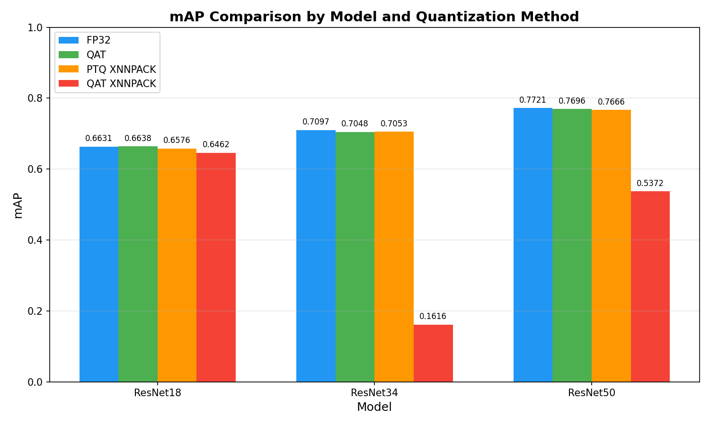
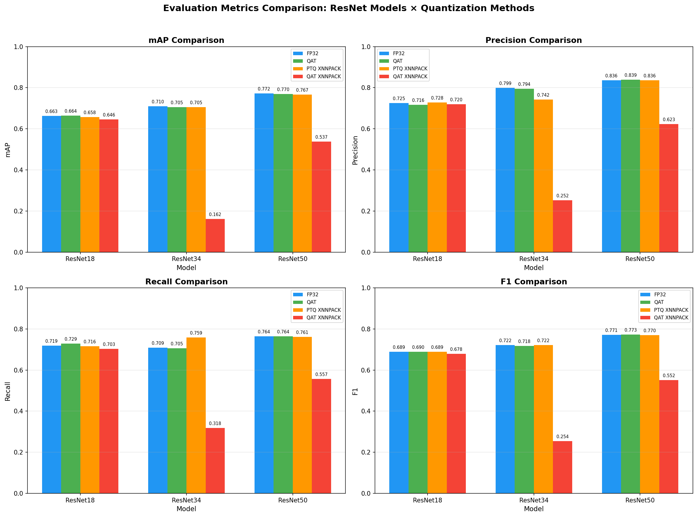
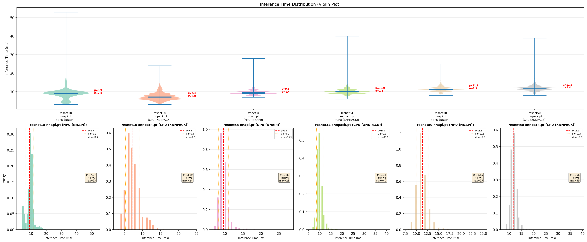
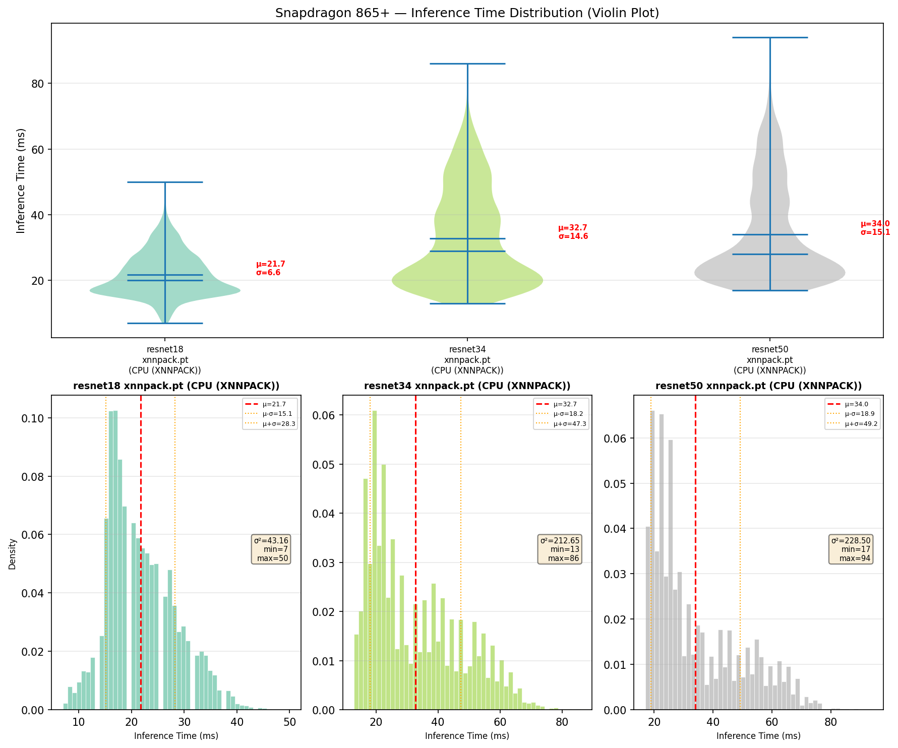
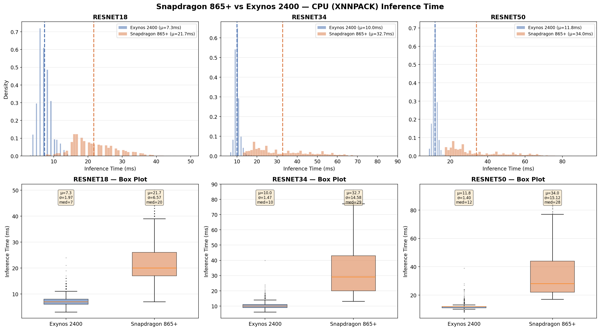

# 스마트폰을 위한 경량 ResNet 기반 사진 자동 태깅 시스템

On-Device AI 기반 실시간 사진 자동 태깅 시스템으로, LSQ(Learned Step Size Quantization) 양자화된 ResNet 모델을 ExecuTorch를 통해 모바일에 배포합니다.

## 프로젝트 개요

| 항목 | 내용 |
|------|------|
| **목표** | COCO 데이터셋 80개 카테고리를 인식하는 다중 레이블 이미지 분류 모델 개발 및 모바일 배포 |
| **모델** | ResNet-18 / ResNet-34 / ResNet-50 (Multi-label Classification) |
| **양자화** | LSQ 8-bit QAT + INT8 Post-Training Quantization |
| **배포** | ExecuTorch (PyTorch Mobile) |
| **타겟 디바이스** | Galaxy S24+ (Exynos 2400, NPU 지원) |

### 지원 모델 비교

| 모델 | 파라미터 | FP32 크기 | INT8 PTQ 크기 | 특징 |
|------|----------|-----------|---------------|------|
| ResNet-18 | 11.7M | ~45 MB | 11 MB | 경량, 빠른 추론 |
| ResNet-34 | 21.8M | ~83 MB | 21 MB | 중간 규모 |
| ResNet-50 | 23.7M | ~90 MB | 23 MB | 높은 정확도 |

## 현재 진행 상황

### 완료된 작업

- [x] ResNet-18/34/50 모델 구현 (다중 레이블 분류)
- [x] COCO 2017 데이터셋 로더 구현
- [x] 데이터 증강 파이프라인 구축
- [x] Full Precision (FP32) 학습 완료 (50 epochs)
- [x] LSQ Quantization-Aware Training (QAT) 완료 (30 epochs)
- [x] 모델 평가 및 성능 측정
- [x] INT8 Post-Training Quantization 구현
- [x] ExecuTorch 모델 변환 (XNNPACK, NNAPI) — 전 모델 PTQ 완료
- [x] ExecuTorch (.pte) 모델 평가 기능 구현

### 전체 모델 평가 결과

> **Note**: 본 프로젝트의 mAP는 **Multi-label Classification mAP** (Precision-Recall AUC 기반)입니다.
> COCO Object Detection mAP (IoU@[0.5:0.95])와는 다른 지표입니다.

#### ResNet-18

| 타입 | mAP | Precision | Recall | F1 |
|------|-----|-----------|--------|-----|
| FP32 | 66.31% | 72.48% | 71.94% | 68.90% |
| QAT | 66.38% | 71.60% | 72.91% | 68.96% |
| PTQ XNNPACK | 65.76% | 72.79% | 71.55% | 68.86% |
| QAT XNNPACK | 64.62% | 72.00% | 70.31% | 67.84% |

#### ResNet-34

| 타입 | mAP | Precision | Recall | F1 |
|------|-----|-----------|--------|-----|
| FP32 | 70.97% | 79.92% | 70.88% | 72.20% |
| QAT | 70.48% | 79.45% | 70.54% | 71.78% |
| PTQ XNNPACK | 70.53% | 74.21% | 75.89% | 72.16% |
| QAT XNNPACK | 16.16% | 25.22% | 31.77% | 25.44% |

#### ResNet-50

| 타입 | mAP | Precision | Recall | F1 |
|------|-----|-----------|--------|-----|
| **FP32** | **77.21%** | **83.64%** | 76.38% | **77.13%** |
| QAT | 76.96% | 83.89% | 76.44% | 77.31% |
| PTQ XNNPACK | 76.66% | 83.57% | 76.14% | 76.99% |
| QAT XNNPACK | 53.72% | 62.26% | 55.73% | 55.18% |

> **최고 성능**: ResNet-50 FP32 모델이 **77.21% mAP**로 가장 높은 정확도를 달성했습니다.
> FP32, QAT, PTQ XNNPACK 간에는 성능 차이가 미미하나, QAT XNNPACK에서 ResNet-34와 ResNet-50의 성능이 크게 하락하는 현상이 관찰됩니다.

#### 시각화





### 모델 크기 비교

| 모델 타입 | 크기 | 설명 |
|-----------|------|------|
| QAT (XNNPACK/NNAPI) | 43 MB | Fake quantization, FP32 weights |
| **INT8 PTQ (XNNPACK/NNAPI)** | **11~23 MB** | Real INT8 weights, Calibration 기반 |
| **QAT INT8 (XNNPACK)** | **23 MB** | QAT 학습 후 INT8 변환 |

### Exported 모델 목록

| 파일명 | 크기 | 설명 |
|--------|------|------|
| `resnet18_multilabel_ptq_xnnpack.pte` | 11 MB | ResNet-18 INT8 PTQ, CPU용 |
| `resnet18_multilabel_ptq_nnapi.pte` | 11 MB | ResNet-18 INT8 PTQ, NPU용 |
| `resnet18_multilabel_qat_xnnpack.pte` | 11 MB | ResNet-18 QAT INT8, CPU용 |
| `resnet34_multilabel_ptq_xnnpack.pte` | 21 MB | ResNet-34 INT8 PTQ, CPU용 |
| `resnet34_multilabel_ptq_nnapi.pte` | 21 MB | ResNet-34 INT8 PTQ, NPU용 |
| `resnet34_multilabel_qat_xnnpack.pte` | 21 MB | ResNet-34 QAT INT8, CPU용 |
| `resnet50_multilabel_ptq_xnnpack.pte` | 23 MB | ResNet-50 INT8 PTQ, CPU용 |
| `resnet50_multilabel_ptq_nnapi.pte` | 23 MB | ResNet-50 INT8 PTQ, NPU용 |
| `resnet50_multilabel_qat_xnnpack.pte` | 24 MB | ResNet-50 QAT INT8, CPU용 |

### 모바일 실제 추론 시간 측정

Galaxy S24+ (Exynos 2400)와 Snapdragon 865+ 디바이스에서 COCO val2017 이미지 5,000장으로 측정한 결과입니다.

#### Exynos 2400 (Galaxy S24+) — CPU (XNNPACK) vs NPU (NNAPI)

| 모델 | 백엔드 | 평균 | 중앙값 | 최소 | 최대 | 표준편차 |
|------|--------|------|--------|------|------|----------|
| ResNet-18 | CPU (XNNPACK) | **7.28ms** | 7ms | 3ms | 45ms | 2.04ms |
| ResNet-18 | NPU (NNAPI) | 8.93ms | 9ms | 3ms | 61ms | 2.92ms |
| ResNet-34 | CPU (XNNPACK) | 10.06ms | 10ms | 6ms | 94ms | 1.89ms |
| ResNet-34 | NPU (NNAPI) | **9.58ms** | 9ms | 7ms | 43ms | 1.45ms |
| ResNet-50 | CPU (XNNPACK) | 11.83ms | 12ms | 8ms | 70ms | 1.62ms |
| ResNet-50 | NPU (NNAPI) | **11.35ms** | 11ms | 8ms | 91ms | 1.71ms |

> ResNet-18에서는 CPU(XNNPACK)가 더 빠르고, ResNet-34/50에서는 NPU(NNAPI)가 더 빠른 결과를 보입니다.
> 모든 모델이 **12ms 이하**의 평균 추론 시간으로 실시간 처리가 가능합니다.

#### Snapdragon 865+ — CPU (XNNPACK)

| 모델 | 백엔드 | 평균 | 중앙값 | 최소 | 최대 | 표준편차 |
|------|--------|------|--------|------|------|----------|
| ResNet-18 | CPU (XNNPACK) | 21.70ms | 20ms | 7ms | 50ms | 6.57ms |
| ResNet-34 | CPU (XNNPACK) | 32.75ms | 29ms | 13ms | 86ms | 14.59ms |
| ResNet-50 | CPU (XNNPACK) | 34.06ms | 28ms | 17ms | 172ms | 15.24ms |

#### Exynos 2400 vs Snapdragon 865+ 비교 (CPU XNNPACK)

| 모델 | Exynos 2400 | Snapdragon 865+ | 속도 차이 |
|------|-------------|-----------------|-----------|
| ResNet-18 | 7.28ms | 21.70ms | Exynos **2.98x** 빠름 |
| ResNet-34 | 10.06ms | 32.75ms | Exynos **3.26x** 빠름 |
| ResNet-50 | 11.83ms | 34.06ms | Exynos **2.88x** 빠름 |

#### 추론 시간 분포 시각화







### 남은 작업

- [x] 모바일 실제 추론 시간 측정 (CPU vs NPU)
- [ ] 배터리 소모량 측정
- [ ] mAP 80% 달성을 위한 추가 학습

## 프로젝트 구조

```
FinalProject/
├── configs/
│   └── config.yaml              # 학습/양자화/배포 설정
├── scripts/
│   ├── download_coco.py         # COCO 데이터셋 다운로드
│   ├── train.py                 # FP32 학습 스크립트
│   ├── train_pt2e_qat.py        # PT2E 기반 QAT 학습 스크립트
│   ├── evaluate.py              # 모델 평가 (PyTorch / ExecuTorch)
│   ├── export_executorch.py     # ExecuTorch INT8 변환 (PTQ / QAT)
│   └── plot_evaluation_results.py # 평가 결과 시각화 그래프 생성
├── src/
│   ├── data/
│   │   ├── dataset.py           # COCO 다중 레이블 데이터셋
│   │   └── augmentation.py      # 데이터 증강 (Resize, Crop, ColorJitter)
│   ├── models/
│   │   ├── resnet.py            # ResNet-18/34/50 구현
│   │   ├── quantization.py      # LSQ 양자화 모듈
│   │   └── int8_export.py       # INT8 Export 유틸리티
│   ├── training/
│   │   ├── trainer.py           # Trainer 클래스 (AMP 지원)
│   │   └── loss.py              # 손실 함수 (BCE, Focal, Asymmetric)
│   ├── inference/
│   │   └── predictor.py         # PyTorch/ExecuTorch 추론
│   └── utils/
│       └── metrics.py           # 평가 지표 (mAP, F1 등)
├── checkpoints/
│   ├── resnet18_fp32/           # ResNet-18 FP32 체크포인트
│   ├── resnet18_qat/            # ResNet-18 QAT 체크포인트
│   ├── resnet34_fp32/           # ResNet-34 FP32 체크포인트
│   ├── resnet34_qat/            # ResNet-34 QAT 체크포인트
│   ├── resnet50_fp32/           # ResNet-50 FP32 체크포인트
│   └── resnet50_qat/            # ResNet-50 QAT 체크포인트
├── exported_models/             # ExecuTorch .pte 모델 파일
├── data/
│   └── coco/                    # COCO 2017 데이터셋
├── logs/                        # TensorBoard 학습 로그
├── notebooks/                   # Jupyter 노트북 (실험용)
├── evaluation_resultses/         # 모델별 평가 결과 및 시각화
│   ├── *_evaluation_results.txt # 모델별 mAP, Precision, Recall, F1
│   ├── mAP_comparison.png       # mAP 비교 그래프
│   └── all_metrics_comparison.png # 전체 메트릭 비교 그래프
├── inference_datas/              # 모바일 추론 시간 측정 데이터
│   ├── exynos_2400/             # Galaxy S24+ (Exynos 2400) 측정 결과
│   ├── snapdragon_865+/         # Snapdragon 865+ 측정 결과
│   └── *.png                    # 추론 시간 분포 시각화
├── reference/                   # 참고 논문 및 제안서
└── requirements.txt             # Python 의존성
```

## 설치 방법

### 1. 환경 설정

```bash
# 가상환경 생성 (권장)
python -m venv .venv
source .venv/bin/activate  # Linux/Mac
# .venv\Scripts\activate   # Windows

# 의존성 설치
pip install -r requirements.txt
```

### 2. COCO 데이터셋 다운로드

```bash
# 전체 데이터셋 (~19GB)
python scripts/download_coco.py

# 검증용 데이터만 (~1GB)
python scripts/download_coco.py --val-only
```

## 커맨드라인 옵션 요약

### train.py

| 옵션 | 설명 | 예시 |
|------|------|------|
| `--model` | 모델 선택 (resnet18, resnet34, resnet50) | `--model resnet50` |
| `--config` | 설정 파일 경로 | `--config configs/config.yaml` |
| `--qat` | QAT 학습 모드 활성화 | `--qat` |
| `--checkpoint` | QAT용 사전학습 체크포인트 | `--checkpoint checkpoints/resnet50_fp32/best_model.pth` |
| `--resume` | 학습 재개용 체크포인트 | `--resume checkpoints/resnet50_fp32/checkpoint_epoch_10.pth` |

### export_executorch.py

| 옵션 | 설명 | 예시 |
|------|------|------|
| `--model` | 모델 선택 | `--model resnet50` |
| `--checkpoint` | 체크포인트 경로 (필수) | `--checkpoint checkpoints/resnet50_fp32/best_model.pth` |
| `--ptq` | PTQ: FP32 모델을 calibration으로 INT8 변환 | `--ptq` |
| `--qat` | QAT: QAT 학습된 모델을 calibration으로 INT8 변환 | `--qat` |
| `--backend` | ExecuTorch 백엔드 (xnnpack, nnapi) | `--backend xnnpack` |
| `--calibration-samples` | Calibration 샘플 수 (기본값: 500) | `--calibration-samples 500` |

### evaluate.py

| 옵션 | 설명 | 예시 |
|------|------|------|
| `--model` | 모델 선택 | `--model resnet50` |
| `--checkpoint` | PyTorch 체크포인트 경로 | `--checkpoint checkpoints/resnet50_fp32/best_model.pth` |
| `--pte` | ExecuTorch 모델 경로 | `--pte exported_models/resnet50_multilabel_ptq_xnnpack.pte` |
| `--qat` | QAT 모델 평가 | `--qat` |

## 사용 방법

### 1. Full Precision 학습

```bash
# ResNet-18 학습 (기본값)
python scripts/train.py --config configs/config.yaml --model resnet18

# ResNet-34 학습
python scripts/train.py --config configs/config.yaml --model resnet34

# ResNet-50 학습 (높은 정확도)
python scripts/train.py --config configs/config.yaml --model resnet50

# 학습 재개
python scripts/train.py --config configs/config.yaml --model resnet50 \
    --resume checkpoints/resnet50_fp32/checkpoint_epoch_10.pth
```

**학습 설정:**
- Epochs: 50
- Batch Size: 64
- Optimizer: SGD (lr=0.1, momentum=0.9, nesterov=True)
- Scheduler: Cosine Annealing
- Loss: Asymmetric Loss (gamma_neg=4, gamma_pos=1)
- Mixed Precision Training (AMP): 활성화

**체크포인트 저장 위치:** `checkpoints/{model_name}_fp32/`

### 2. Quantization-Aware Training (QAT)

```bash
# ResNet-18 QAT
python scripts/train.py \
    --config configs/config.yaml \
    --model resnet18 \
    --qat \
    --checkpoint checkpoints/resnet18_fp32/best_model.pth

# ResNet-34 QAT
python scripts/train.py \
    --config configs/config.yaml \
    --model resnet34 \
    --qat \
    --checkpoint checkpoints/resnet34_fp32/best_model.pth

# ResNet-50 QAT
python scripts/train.py \
    --config configs/config.yaml \
    --model resnet50 \
    --qat \
    --checkpoint checkpoints/resnet50_fp32/best_model.pth
```

**QAT 설정:**
- Epochs: 30
- Learning Rate: 0.001 (LSQ 논문 권장)
- Batch Size: 32 (AMP OFF → FP32 메모리 사용)
- AMP: OFF (FP16이 LSQ step_size 학습을 방해)
- Weight Decay: 1e-4
- 제외 레이어: conv1 (첫 번째 레이어), fc (마지막 레이어)

**체크포인트 저장 위치:** `checkpoints/{model_name}_qat/`

### 3. 모델 평가

```bash
# FP32 모델 평가
python scripts/evaluate.py \
    --checkpoint checkpoints/resnet18_fp32/best_model.pth \
    --model resnet18

python scripts/evaluate.py \
    --checkpoint checkpoints/resnet50_fp32/best_model.pth \
    --model resnet50

# QAT 모델 평가
python scripts/evaluate.py \
    --checkpoint checkpoints/resnet50_qat/best_model.pth \
    --model resnet50 \
    --qat
```

### 4. ExecuTorch 변환 (모바일 배포용)

두 가지 모드 모두 **native INT8 연산** (.pte)을 생성합니다.

#### PTQ (Post-Training Quantization) — FP32 모델 사용

```bash
# ResNet-18 XNNPACK 백엔드 (CPU)
python scripts/export_executorch.py \
    --checkpoint checkpoints/resnet18_fp32/best_model.pth \
    --model resnet18 \
    --ptq \
    --backend xnnpack

# ResNet-50 NNAPI 백엔드 (NPU)
python scripts/export_executorch.py \
    --checkpoint checkpoints/resnet50_fp32/best_model.pth \
    --model resnet50 \
    --ptq \
    --backend nnapi
```

#### QAT → INT8 — QAT 학습된 모델 사용 (더 높은 정확도)

```bash
# ResNet-50 XNNPACK 백엔드 (CPU)
python scripts/export_executorch.py \
    --checkpoint checkpoints/resnet50_qat/best_model.pth \
    --model resnet50 \
    --qat \
    --backend xnnpack
```

**두 모드 비교:**

| 모드 | 입력 모델 | 정확도 | 설명 |
|------|-----------|--------|------|
| `--ptq` | FP32 체크포인트 | 보통 | Calibration만으로 INT8 변환 |
| `--qat` | QAT 체크포인트 | 높음 | QAT로 양자화에 최적화된 weights 사용 |

**출력 파일명:** `exported_models/{model_name}_multilabel_{ptq|qat}_{backend}.pte`

### 5. ExecuTorch 모델 평가

```bash
# PTQ 모델 평가 (ExecuTorch)
python scripts/evaluate.py --pte exported_models/resnet18_multilabel_ptq_xnnpack.pte
python scripts/evaluate.py --pte exported_models/resnet50_multilabel_ptq_xnnpack.pte

# QAT INT8 모델 평가 (ExecuTorch)
python scripts/evaluate.py --pte exported_models/resnet50_multilabel_qat_xnnpack.pte
```

### 6. TensorBoard 로그 확인

```bash
tensorboard --logdir logs/
```

## 기술 스택

| 항목 | 기술 | 버전 |
|------|------|------|
| 학습 프레임워크 | PyTorch | >= 2.0.0 |
| 모바일 배포 | ExecuTorch | >= 1.0.0 |
| 양자화 라이브러리 | torchao | >= 0.4.0 |
| 데이터셋 | COCO 2017 | 80 카테고리 |
| 하드웨어 가속 | NNAPI / XNNPACK | NPU/CPU 지원 |

## 모델 아키텍처

### 지원 모델

| 모델 | 블록 타입 | 레이어 구성 | FC 입력 차원 |
|------|-----------|-------------|--------------|
| ResNet-18 | BasicBlock | [2, 2, 2, 2] | 512 |
| ResNet-34 | BasicBlock | [3, 4, 6, 3] | 512 |
| ResNet-50 | Bottleneck | [3, 4, 6, 3] | 2048 |

### ResNet 구조

```
Input (3, 224, 224)
    ↓
Conv1 (7x7, 64, stride=2) → BN → ReLU
    ↓
MaxPool (3x3, stride=2)
    ↓
Layer1: N × Block (64 channels)
    ↓
Layer2: N × Block (128 channels, stride=2)
    ↓
Layer3: N × Block (256 channels, stride=2)
    ↓
Layer4: N × Block (512 channels, stride=2)
    ↓
AdaptiveAvgPool (1, 1)
    ↓
FC (512/2048 → 80) + Sigmoid
    ↓
Output: 80 class probabilities
```

- **BasicBlock** (ResNet-18/34): Conv3x3 → BN → ReLU → Conv3x3 → BN → Skip
- **Bottleneck** (ResNet-50): Conv1x1 → BN → ReLU → Conv3x3 → BN → ReLU → Conv1x1 → BN → Skip

### 양자화 비교

| 방식 | 학습 | 모델 크기 | 특징 |
|------|------|----------|------|
| **LSQ QAT** | 학습 중 양자화 시뮬레이션 | 43 MB | Fake quantization, 높은 정확도 |
| **INT8 PTQ** | 학습 후 양자화 | **11~23 MB** | Real INT8 weights, Calibration 기반 |

## 파이프라인 개요

```
┌─────────────────────────────────────────────────────────────────┐
│                    Training Pipeline (PC/Server)                 │
├─────────────────────────────────────────────────────────────────┤
│                                                                  │
│  COCO Dataset ──→ Data Augmentation ──→ ResNet Training         │
│       │                                       │                  │
│       │                                       ↓                  │
│       │                              FP32 Model (mAP: ~67%)      │
│       │                                       │                  │
│       │                            ┌──────────┴──────────┐       │
│       │                            ↓                     ↓       │
│       │                      LSQ QAT Training      INT8 PTQ      │
│       │                            │                     │       │
│       │                            ↓                     ↓       │
│       │                   QAT Model (43MB)    PTQ Model (11~23MB)│
│       │                            │                     │       │
│       │                            └──────────┬──────────┘       │
│       │                                       ↓                  │
│       │                            ExecuTorch Export (.pte)      │
│       │                              ┌───────┴───────┐           │
│       │                              ↓               ↓           │
│       │                          XNNPACK          NNAPI          │
│       │                           (CPU)           (NPU)          │
└─────────────────────────────────────────────────────────────────┘
                                   ↓
┌─────────────────────────────────────────────────────────────────┐
│                    Inference Pipeline (Mobile)                   │
├─────────────────────────────────────────────────────────────────┤
│                                                                  │
│  Camera/Gallery ──→ Image Preprocessing ──→ ExecuTorch Runtime  │
│                           (224x224)               │              │
│                                                   ↓              │
│                                         Integer Inference        │
│                                      (INT8 optimized for NPU)    │
│                                               │                  │
│                                               ↓                  │
│                                    80 Category Predictions       │
│                                               │                  │
│                                               ↓                  │
│                                      Tag Generation              │
│                                                                  │
└─────────────────────────────────────────────────────────────────┘
```

> **mAP 지표 설명**: 위 다이어그램의 mAP는 Multi-label Classification mAP (PR-AUC 기반)입니다.

## 주요 기능

### 1. 다중 레이블 분류
- 하나의 이미지에서 여러 객체/카테고리 동시 인식
- Sigmoid 활성화 함수로 각 클래스 독립적 확률 출력
- 임계값(threshold=0.5) 기반 태그 결정

### 2. 손실 함수 지원
- **BCEWithLogitsLoss**: 기본 이진 교차 엔트로피
- **FocalLoss**: 클래스 불균형 대응
- **AsymmetricLoss**: 다중 레이블 최적화 (기본 사용)

### 3. 학습 최적화
- **Mixed Precision Training (AMP)**: FP16으로 학습 속도 ~2배 향상
- **CuDNN Benchmark**: 입력 크기 고정 시 자동 최적화
- **Pin Memory**: CPU-GPU 데이터 전송 최적화

### 4. 양자화
- **LSQ (Learned Step Size Quantization)**: 학습 가능한 스텝 크기
- **INT8 PTQ**: Post-Training Quantization으로 실제 INT8 변환
- **Per-tensor Quantization**: ExecuTorch 호환 양자화

### 5. 모바일 배포
- ExecuTorch를 통한 .pte 모델 생성
- XNNPACK (CPU) / NNAPI (NPU) 백엔드 지원
- Android 앱에서 ExecuTorch Runtime으로 추론 가능 (별도 프로젝트)

## 참고 문헌

1. **ResNet**: He et al., "Deep Residual Learning for Image Recognition" (CVPR 2016)
2. **LSQ**: Esser et al., "Learned Step Size Quantization" (ICLR 2020)
3. **Integer-Only Inference**: Jacob et al., "Quantization and Training of Neural Networks for Efficient Integer-Arithmetic-Only Inference" (CVPR 2018)

## 라이선스

이 프로젝트는 학술 연구 목적으로 개발되었습니다.
